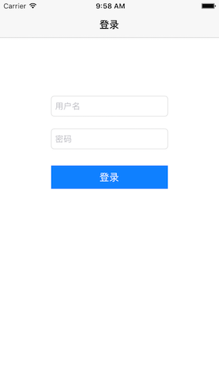
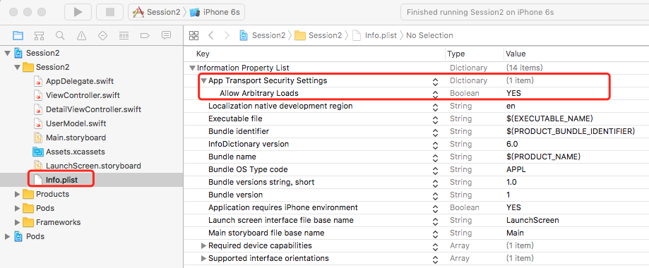
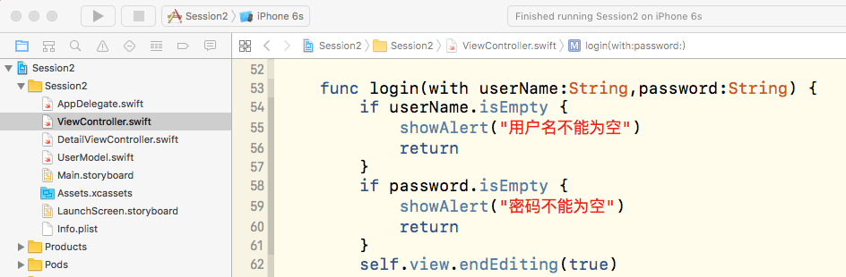
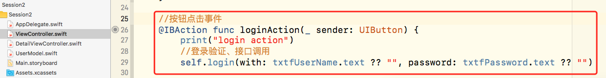
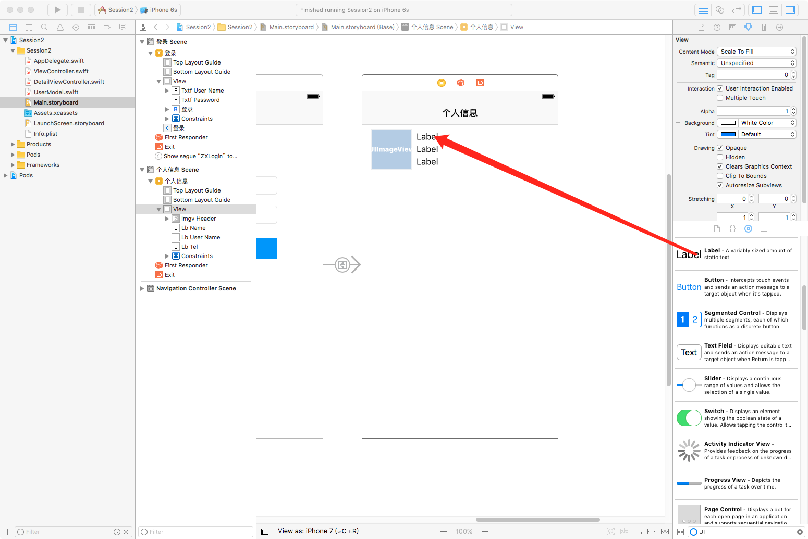
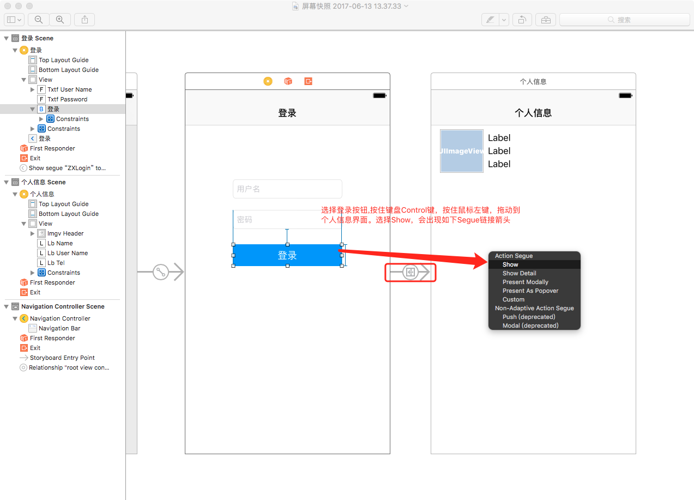
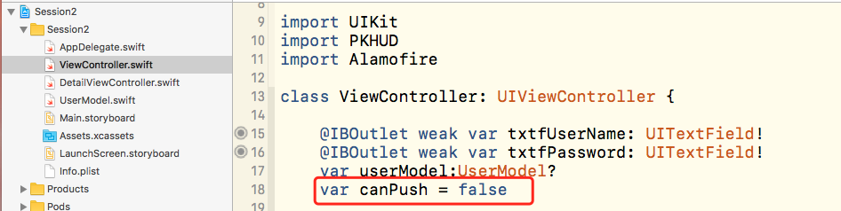
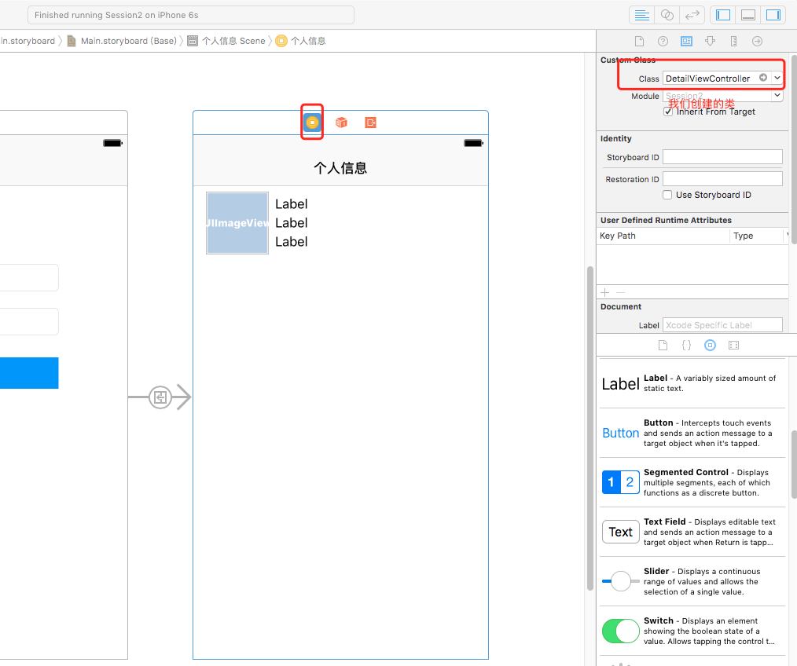
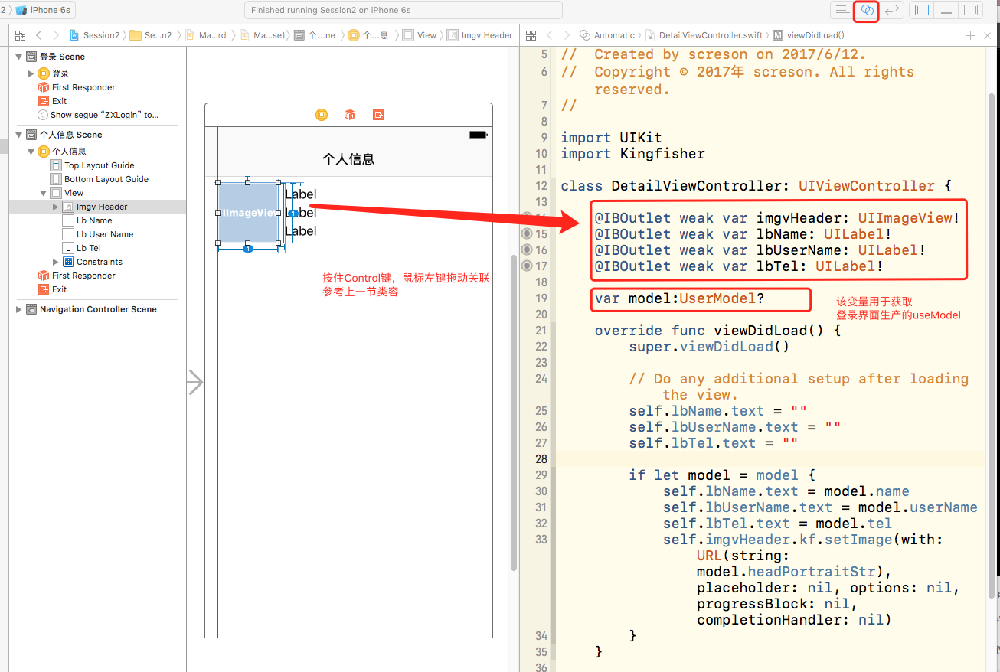

### iOS开发 基础篇二

`任务`

>
- 点击登录访问网络接口
- 解析接口返回JSON数据 
- 登录成功跳转到用户界面并显示头像、名称等信息

##### 上节回顾

>



##### Xcode HTTP支持配置

>
iOS9之后,默认不支持HTTP接口的访问。
>
如果程序技术使用HTTP接口,需要完成如下配置。

>


##### 网络接口对接

- `URLSession(系统原生API)`

`GET`

```
let url = "http://www.weather.com.cn/data/cityinfo/101010100.html?a=1"
let session = URLSession.shared
let task = session.dataTask(with: URL(string:url)!, completionHandler: { (data, response, error) in
    if error == nil {
        if let response = response as? HTTPURLResponse,response.statusCode == 200 {
            if let data = data {
                do {
                    let jsonObj = try JSONSerialization.jsonObject(with: data, options: .mutableContainers)
                    print(String.init(data: data, encoding: .utf8) ?? "")
                    print(jsonObj as! Dictionary<String,Any>)
                } catch {
                    print("解析JSON失败")
                }
            } else {
                print("数据返回为空")
            }
        } else {
            print((response as! HTTPURLResponse).description)
        }
    } else {
        print(error!.localizedDescription)
    }
})
task.resume()
```

`POST`

```
let url = "http://192.168.0.203:5008/user/login"
var request = URLRequest(url: URL(string: url)!)
request.httpMethod = "POST"
let params = "userName=\(userName)&passWord=\(password)"
request.httpBody = params.data(using: .utf8)
request.timeoutInterval = 5
let session = URLSession.shared
let task = session.dataTask(with: request, completionHandler: { (data, response, error) in
    if error == nil {
        if let response = response as? HTTPURLResponse,response.statusCode == 200 {
            if let data = data {
                do {
                    let jsonObj = try JSONSerialization.jsonObject(with: data, options: .mutableContainers)
                    print(String.init(data: data, encoding: .utf8) ?? "")
                    print(jsonObj as! Dictionary<String,Any>)
                } catch {
                    print("解析JSON失败")
                }
            } else {
                print("数据返回为空")
            }
        } else {
            print((response as! HTTPURLResponse).description)
        }
    } else {
        print(error!.localizedDescription)
    }
})
task.resume()
```

- [第三方网络请求库 Alamofire](https://github.com/Alamofire/Alamofire/)

`GET`

```
Alamofire.request("http://www.weather.com.cn/data/cityinfo/101010100.html?a=1").responseJSON { (data) in
    print(data.value)
}
```

`POST`

```
Alamofire.request("http://192.168.0.203:5008/user/login", method: .post, parameters: ["userName":"","passWord":"",], encoding: JSONEncoding.default, headers: nil).responseJSON { (data) in
    print(data.result)
}
```

##### 完善登录事件

`1.在ViewController中添加登录方法实现`

>


```
func login(with userName:String,password:String) {
	if userName.isEmpty {
	    showAlert("用户名不能为空")
	    return
	}
	if password.isEmpty {
	    showAlert("密码不能为空")
	    return
	}
	self.view.endEditing(true)
	    
	let url = "http://115.182.15.118:5008/user/login"
	var request = URLRequest(url: URL(string: url)!)
	request.httpMethod = "POST"
	let params = "userName=\(userName)&passWord=\(password)"
	request.httpBody = params.data(using: .utf8)
	request.timeoutInterval = 5
	    
	let session = URLSession.shared
	let task = session.dataTask(with: request) { (data, response, error) in
	    DispatchQueue.main.async {
	        if error == nil {
	            if let response = response as? HTTPURLResponse,response.statusCode == 200 {
	                if let data = data {

	                } else {
	                    self.showAlert("数据返回为空...")
	                }
	            } else {
	                self.showAlert((response as! HTTPURLResponse).description)
	            }
	        } else {
	            self.showAlert(error!.localizedDescription)
	        }
	    }
	}
	task.resume()
}
```

`2.修改Button点击事件`

>



#####  JSON数据解析
  
- `JSONSerialization(系统原生)`

```
if let content = try? JSONSerialization.jsonObject(with: data, options: .allowFragments) as? [String: Any],
    let user = content["status"] as? Int,
    // Finally we got the username
}
```

- [SwiftJson](https://github.com/SwiftyJSON/SwiftyJSON)

```
let json = JSON(data: data)
if let userName = content["status"].Int {

}
```

`3.解析接口数据`

>
接口格式：
>
```
{
	status:"000000",
	data:{...},
	msg:""
}
```

`完善login方法`

```
func login(with userName:String,password:String) {
	xxx
	xxx
	if let data = data {
	   // 插入在这里
		do {
		    let jsonObj = try JSONSerialization.jsonObject(with: data, options: .mutableContainers) //转换为json对象
		    if let obj = jsonObj as? Dictionary <String,Any> {
		        if let code = obj["status"] as? String,Int(code) == 0 {//status = 0 登录成功
		        print("登录成功")
		        } else {
		            self.showAlert(obj["msg"] as? String ?? "未知错误")
		        }
		    } else {
		        self.showAlert("数据格式错误")
		    }
		} catch {
		    self.showAlert("数据格式错误")
		}
	}
	xxx
	xxx
}
```

`4.创建用户信息Model，便于传递给详情界面`

>
新建文件 (commad+N) UserModel

>

```
class UserModel: NSObject {
    var id:Int32 = 0			//id
    var userName:String = ""	//用户名
    var name:String = ""		//姓名
    var tel:String = ""			//电话
    var headPortraitStr:String = "" //头像
    //其他需要字段自行定义....
    
    //重写该方法 空实现
    //避免调用 setValuesForKeys 是系统crash
    override func setValue(_ value: Any?, forUndefinedKey key: String) {
        
    }
}

```

`5.1ViewController 定义userModel变量`

>


`5.2完善longin 方法，给model赋值`

```
func login(with userName:String,password:String) {
	xxx
	xxx
	if let data = data {
		do {
		xxx
		xxx
		    if let obj = jsonObj as? Dictionary <String,Any> {
		        if let code = obj["status"] as? String,Int(code) == 0 {//
		        	// 插入在这里
						let model = UserModel()
						model.setValuesForKeys(obj["data"] as! Dictionary<String,Any>)
						self.userModel = model
					}
					xxx
					xxx
```

  
##### UI界面更新及跳转

`6.添加用户详情界面`

`6.1打开Main.storyboard 拖一个ViewController`

>


`6.2给新的ViewController 添加1个图片控件 3个Label控件(参考上一节)`

>


`6.3连接界面,用户点击登录案例跳转到[个人信息界面]`

>


`6.4修改segue id (名称自行定义)后面会用到`

>


>
此时,运行程序.点击登录会跳转到个人信息界面。
>
为了接口成功之后才跳转，我们在ViewController中添加如下代码


`6.5在ViewController定义canPush变量,用于控制是否跳转到[个人信息界面]`

>


`6.6在ViewController重新如下方法`

>


```
override func shouldPerformSegue(withIdentifier identifier: String, sender: Any?) -> Bool {
    return canPush
}
```

`6.6登录成功将canpush赋值为true,并执行segue`

```
func login(with userName:String,password:String) {
	xxx
	xxx
	if let data = data {
		do {
		xxx
		xxx
		    if let obj = jsonObj as? Dictionary <String,Any> {
		        if let code = obj["status"] as? String,Int(code) == 0 {//
						let model = UserModel()
						model.setValuesForKeys(obj["data"] as! Dictionary<String,Any>)
						self.userModel = model
						// 插入在这里
						self.canPush = true
						//执行Segue
						self.performSegue(withIdentifier: "ZXLogin", sender: nil)
					}
					xxx
					xxx
```


##### `至此,login func 代码如下`

```
func login(with userName:String,password:String) {
    if userName.isEmpty {
        showAlert("用户名不能为空")
        return
    }
    if password.isEmpty {
        showAlert("密码不能为空")
        return
    }
    self.view.endEditing(true)
    
    PKHUD.sharedHUD.contentView = PKHUDProgressView()
    PKHUD.sharedHUD.show()
    
    let url = "http://115.182.15.118:5008/user/login"
    var request = URLRequest(url: URL(string: url)!)
    request.httpMethod = "POST"
    let params = "userName=\(userName)&passWord=\(password)"
    request.httpBody = params.data(using: .utf8)
    request.timeoutInterval = 5
    
    let session = URLSession.shared
    let task = session.dataTask(with: request) { (data, response, error) in
        DispatchQueue.main.async {
            PKHUD.sharedHUD.hide()
            if error == nil {
                if let response = response as? HTTPURLResponse,response.statusCode == 200 {
                    if let data = data {
                        do {
                            let jsonObj = try JSONSerialization.jsonObject(with: data, options: .mutableContainers)
                            print(String.init(data: data, encoding: .utf8) ?? "")
                            if let obj = jsonObj as? Dictionary <String,Any> {
                                if let code = obj["status"] as? String,Int(code) == 0 {
                                    let model = UserModel()
                                    model.setValuesForKeys(obj["data"] as! Dictionary<String,Any>)
                                    self.userModel = model
                                    self.canPush = true
                                    //执行Segue
                                    self.performSegue(withIdentifier: "ZXLogin", sender: nil)
                                } else {
                                    self.showAlert(obj["msg"] as? String ?? "未知错误")
                                }
                            } else {
                                self.showAlert("数据格式错误")
                            }
                        } catch {
                            self.showAlert("数据格式错误")
                        }
                    } else {
                        self.showAlert("数据返回为空...")
                    }
                } else {
                    self.showAlert((response as! HTTPURLResponse).description)
                }
            } else {
                self.showAlert(error!.localizedDescription)
            }
        }
    }
    task.resume()
}
    
//MARK: - 警告框
func showAlert(_ msg:String) {
    let alert = UIAlertController(title: "提示", message: msg, preferredStyle: .alert)
    alert.addAction(UIAlertAction(title: "确定", style: .default, handler: nil))
    self.present(alert, animated: true, completion: nil)
}
```


>
到这里,我们完成的接口调用、数据解析，
>
并且登录正确账户密码之后跳转到用户信息界面
>
接下来，需要通过userModel 给详情界面控件赋值

`7.将个人信息界面与代码关联`


`7.1 command+N , 新建DetailViewController.swift`

`7.2 将Storeboard 用户信息界面与DetailViewController类关联`

>



`7.3 连接控件输出(参考上一节)`

>



`7.3 DetailViewController 完成控件赋值`

>
网络图片加载

>
使用cocoapods安装KingFisher(见上一节文档)

- [KingFisher](https://github.com/onevcat/Kingfisher)

```
let url = URL(string: "url_of_your_image")
imageView.kf.setImage(with: url)
```

```
override func viewDidLoad() {
    super.viewDidLoad()

    // Do any additional setup after loading the view.
    self.lbName.text = ""
    self.lbUserName.text = ""
    self.lbTel.text = ""
    
    if let model = model {
        self.lbName.text = model.name
        self.lbUserName.text = model.userName
        self.lbTel.text = model.tel
        self.imgvHeader.kf.setImage(with: URL(string: model.headPortraitStr), placeholder: nil, options: nil, progressBlock: nil, completionHandler: nil)
    }
}

```

- `最终效果`


---
`CreateBy:JanFelix@screson 2017/06/14`


