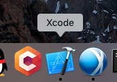
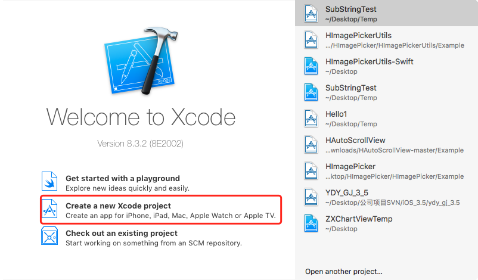
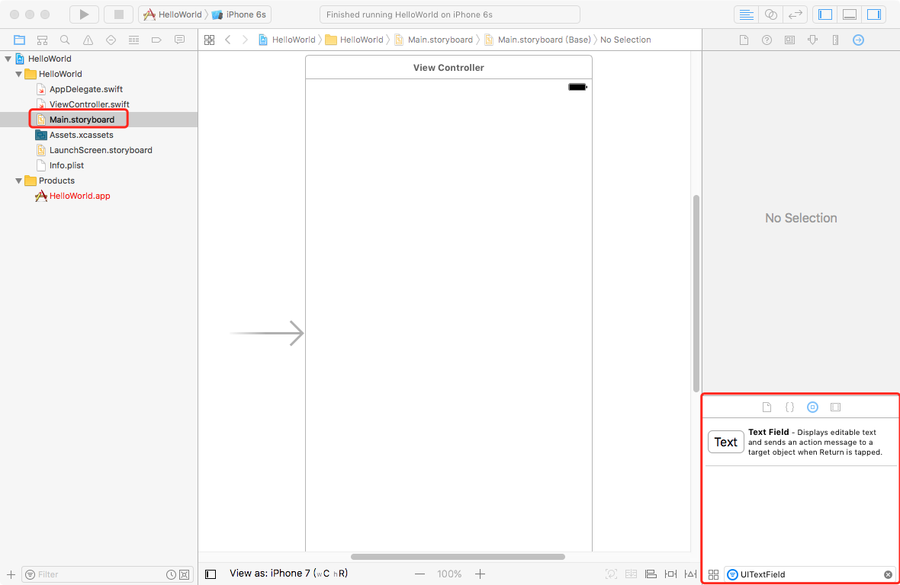
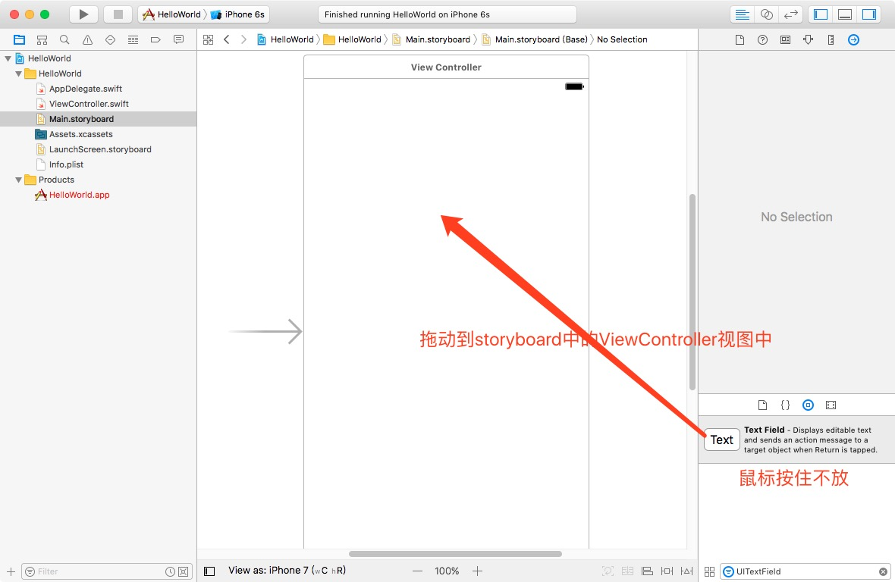
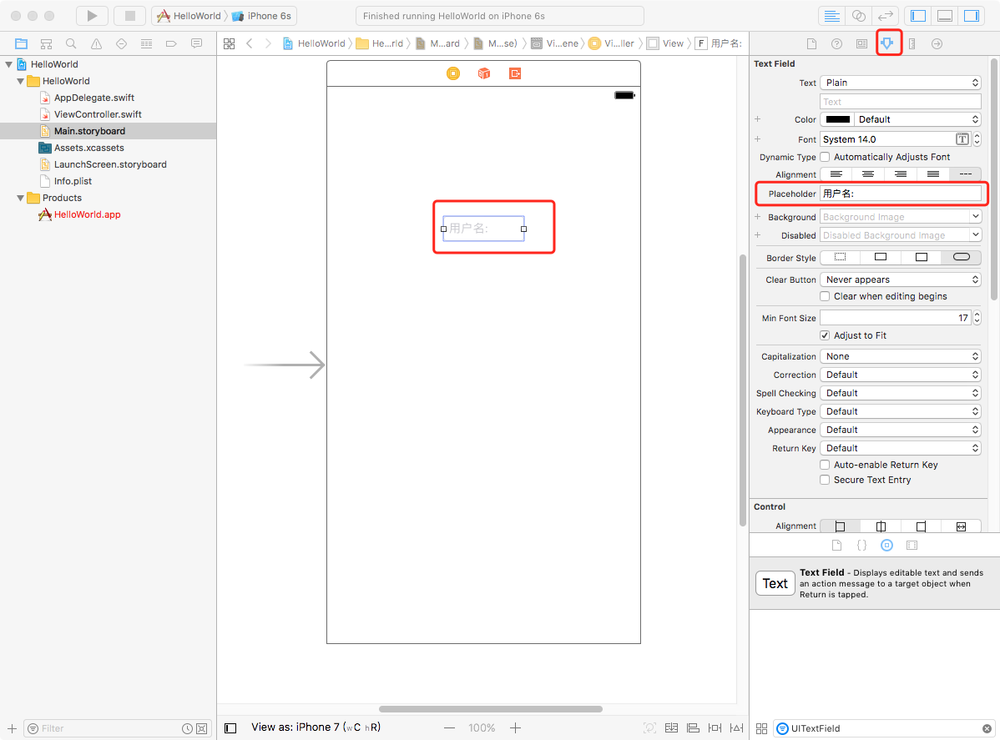
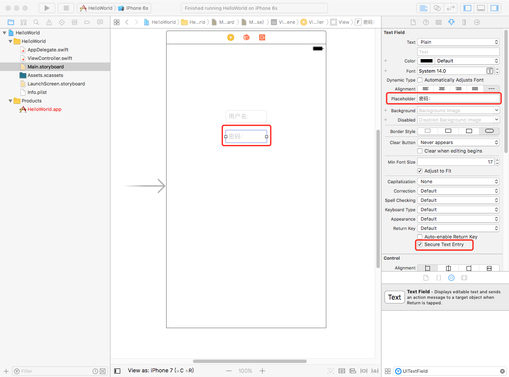
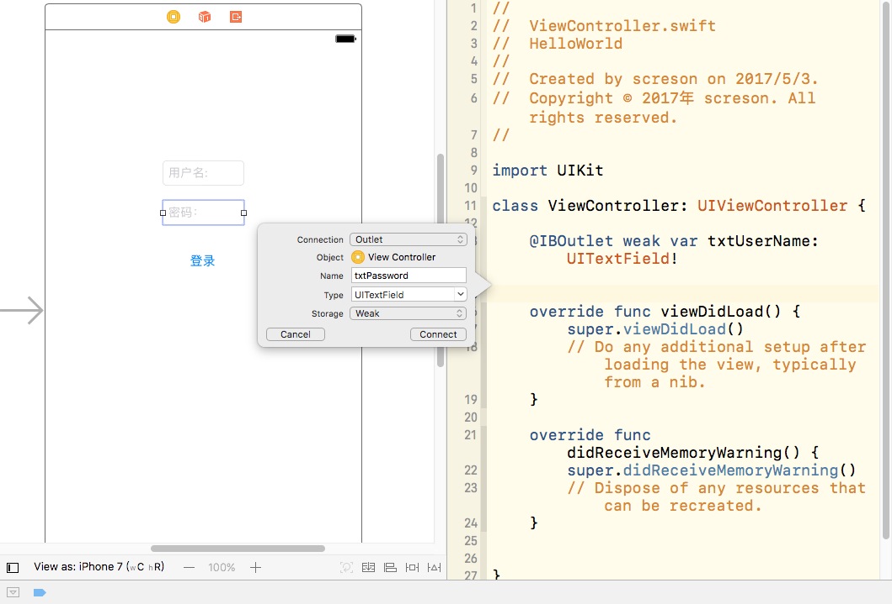
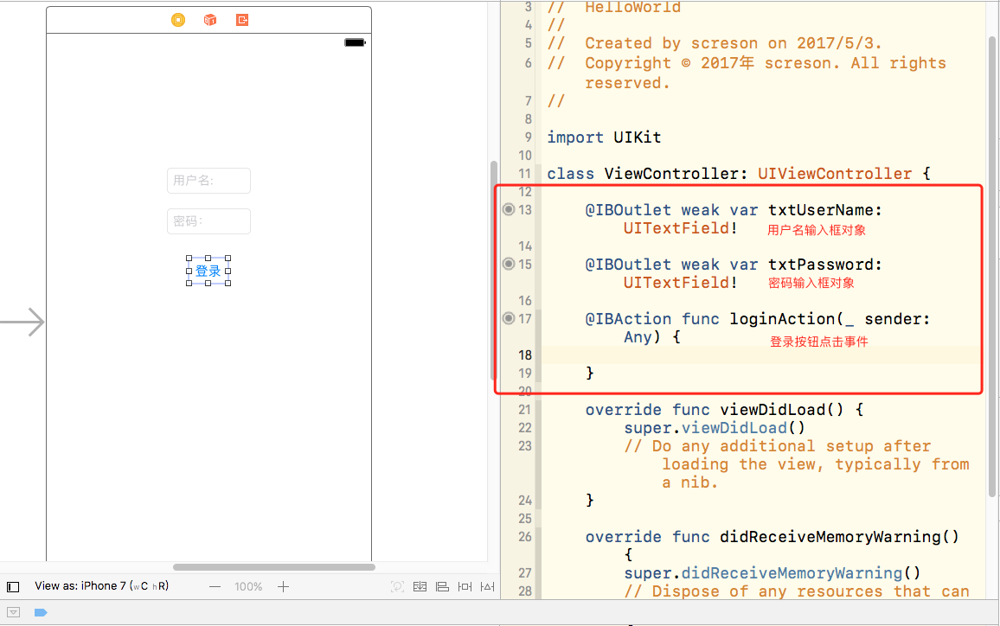
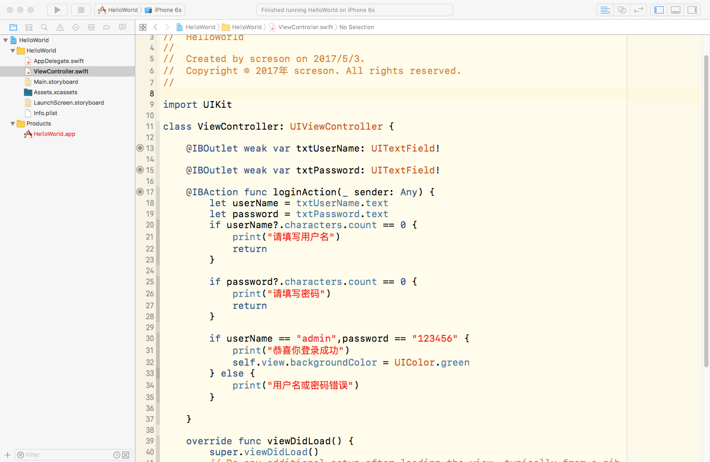
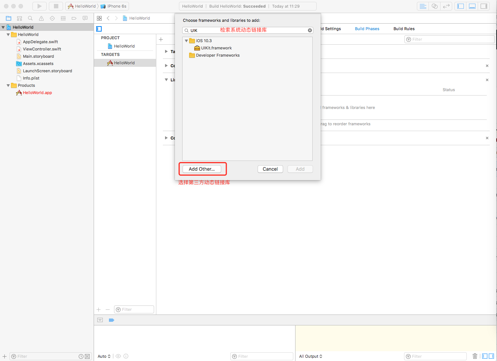

## `iOS 开发 基础篇 (一)`

### `开发前准备`

- 一台装有macOS的电脑

	>
	`Mac Mini/Air 、Mac book系列`
	>
	`不建议选择黑苹果或虚拟机`
	>
	`操作系统最新版本macOS Sierra 10.12.4`


- [Xcode IDE](https://itunes.apple.com/cn/app/xcode/id497799835?mt=12)

	>
	`当前最新版本 8.3.2`

- [Apple ID](https://appleid.apple.com/account?localang=en_US&appId=632&returnURL=https%3A%2F%2Fidmsa.apple.com%2FIDMSWebAuth%2Flogin.html%3FappIdKey%3D891bd3417a7776362562d2197f89480a8547b108fd934911bcbea0110d07f757%26path%3D%2Faccount%2F%26language%3DUS-EN%26rv%3D1)
- 一台iOS设备(iPhone/iPad/iPod均可)

### `语言基础`

- Objective-C 2.0
- [Swift 3.x](https://swift.org)

`The Swift Programming Language`

- 
	
	>
	[EPUB](https://swift.org/documentation/TheSwiftProgrammingLanguage(Swift3.1).epub)
	>
	[中文](https://github.com/numbbbbb/the-swift-programming-language-in-chinese)

### `API`


`包含macOS/iOS/watchOS/tvOS 应用开发`


- [API](https://developer.apple.com/reference/)
- [Videos](https://developer.apple.com/videos/)
- [SimpleCode](https://developer.apple.com/library/content/navigation/#section=Resource%20Types&topic=Sample%20Code)

### `其他学习资源`

`e.g.`

- [code4app](http://code4app.com)
- [raywenderlich](https://www.raywenderlich.com/category/ios)
- [Books](https://store.raywenderlich.com/?_ga=2.140625778.1701403902.1493715580-1479741476.1486966803)


-


### `工程创建`

- `1.打开Xcode`

	>
	

- `2.点击创建新工程->Next`

	>
	

- `3.选择对应工程模板->Next`

`iOS/SingleViewApplication`

- 
	
	>
	

- `4.填写基本信息->Next`

	>
	

- `5.选择保存路径->Create`

	>
	

- `6.编译运行`

	>
	


-

### `LoginDemo`

##### `UI`

- `1.单击打开Main.storyboard`

	>
	

- `2.添加输入框`

	>
	

- `3.修改PlaceHolder`

	>
	 

- `4.同理添加第二个输入框`

`修改PlaceHolder为[密码：]，并勾选[Secure Text Entry]`

- 
	
	>
	


- `5.添加一个Button`

	>
	

- `6.修改Button文字为[登录]`

	>
	

- `7.点击Xcode左上角运行按钮(快捷键command+r),运行程序`

	>
	


##### `关联事件、获取文本`

- `8.关联[用户名]输入框对象引用`


`同时按下control键和鼠标左键，拖动`

- 

	>
	

`松开键盘和鼠标,填写名称，并点击connect`

- 
	
	>
	

`Xcode会自动填充对应代码`


- 

	>
	

- `9.同上，关联[密码]输入框对象引用`

	>
	

- `10.同上，管理[登录]点击事件`

**`注意:`此处Connection 必须选择Action**

- 
	>
	

- `11.最终连接输出后代码如下`

	>
	

- `12.实现[登录]事件逻辑代码`

	```python
	@IBAction func loginAction(_ sender: Any) {
	    let userName = txtUserName.text//获取用户名文本
	    let password = txtPassword.text//获取密码文本
	    if userName?.characters.count == 0 {//非空
	        print("请填写用户名")
	        return
	    }
	    
	    if password?.characters.count == 0 {//非空
	        print("请填写密码")
	        return
	    }
	    
	    if userName == "admin",password == "123456" {//用户名密码正确
	        print("恭喜你登录成功")
	        self.view.backgroundColor = UIColor.green//修改视图背景颜色为绿色
	    } else {
	        print("用户名或密码错误")
	    }
	}
	```

	>
	


- `13.编译运行[command+r]`

`输入正确用户名密码：admin/123456`

- 

	>
	


-

### `库文件管理工具`

- `CocoaPods`

	>
	[官网](https://guides.cocoapods.org)
	>
	[CocoaPods](https://github.com/CocoaPods/CocoaPods)
	>
	[教程](http://code4app.com/article/cocoapods-install-usage)

- `Carthage`

	>[Carthage](https://github.com/Carthage/Carthage)
	>
	>[教程](http://www.skyfox.org/cocoa-carthage-install-and-usage.html)

- `SPM`

	>[Apple/swift-package-manager](https://github.com/apple/swift-package-manager)

- `常用的三方库(e.g.)：`

	>[AFNetworking-OC网络请求](https://github.com/AFNetworking/AFNetworking)
	
	>[Alamofire-Swift网络请求](https://github.com/Alamofire/Alamofire)
	
	>[Masonry-OC自动布局](https://github.com/SnapKit/Masonry)
	
	>[SnapKit-Swift自动布局](https://github.com/SnapKit/SnapKit)
	
	>[SDWebImage-OC图片缓存](https://github.com/rs/SDWebImage)
	
	
	>[Kingfisher-Swift图片缓存](https://github.com/onevcat/Kingfisher.git)
	
	>[MJRefresh-OC下拉刷新](https://github.com/CoderMJLee/MJRefresh)
	
	>[MBProgressHUD-OC加载指示器](https://github.com/matej/MBProgressHUD.git)

- `...`

### `Framework导入`


`选中工程`
`点击Build Phase`
`展开 Link Binary With Libraries`
`点击 + 添加`

- 

	>
	

- `检索 用于系统链接库`
- `Add Other 用于添加第三方链接库`

	>
	

`另：第三方链接库也可通过鼠标，直接拖入到工程资源目录列表`

### `打包发布`

`条件`

- 开发账号

	>[申请地址](https://developer.apple.com/programs/)

- `证书、配置文件`

- [参考教程](http://blog.csdn.net/jingyipo/article/details/51596135)


-

### `ZXStruct-Swift`

- [ZXStructs](https://github.com/iFallen/ZXStructs-Swift)

---

`CreateBy:JuanFelix@screson`